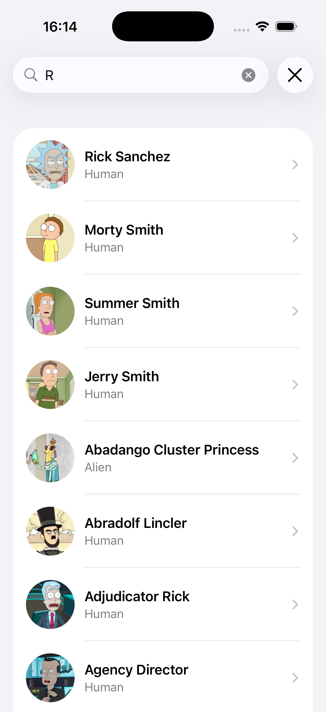
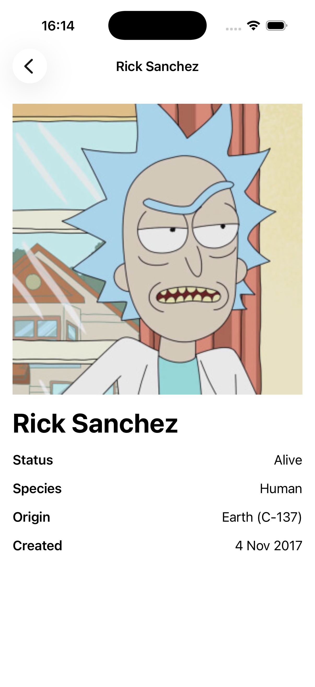

# RickAndMortyCharacterApp

## Scope
SwiftUI iOS client that performs name-based character search against the public Rick and Morty API and renders a list + detail flow. No persistence, caching, or offline behavior is implemented.

## High-Level Architecture
- **App Entry**: `RickAndMortyCharacterApp/RickAndMortyCharacterAppApp.swift`
- **UI Layer**: SwiftUI views under `RickAndMortyCharacterApp/Search/View`
- **State + Logic**: `RickAndMortyCharacterApp/Search/ViewModel/CharacterSearchViewModel.swift`
- **Networking**: `RickAndMortyCharacterApp/Network/APIClient.swift` + request types in `RickAndMortyCharacterApp/Search/Request`
- **Models**: `RickAndMortyCharacterApp/Search/Model/CharacterResponse.swift`
- **Utilities**: `RickAndMortyCharacterApp/Utility/Extensions/StringExtension.swift`

## Data Flow
1. `CharacterSearchView` binds `searchText` to `CharacterSearchViewModel`.
2. The view model debounces input (300ms) and triggers `performSearch`.
3. `FetchCharactersRequest` builds a request for `/character?name={query}`.
4. `APIClient` performs the request and decodes JSON into `CharacterResponse`.
5. The view model maps results into a simple state machine, which drives UI rendering.

## State Model
Defined in `CharacterSearchViewState`:
- `idle`: no query.
- `loading`: request in-flight.
- `loaded([CharacterResult])`: results available.
- `empty`: successful response, no results.
- `error(String)`: request failed.

This keeps UI logic declarative and makes the view a pure rendering of state.

## Concurrency + Cancellation
Search requests run in an `async` `Task` stored by the view model. On new input, the previous task is cancelled to avoid out-of-order updates.

## Networking
`APIClient` abstracts `URLSession` with a generic `APIRequest` protocol:
- Requests supply a `URLRequest`.
- Responses are decoded via `JSONDecoder`.
- Non-2xx responses throw `URLError(.badServerResponse)`.

## Date Handling
API `created` strings are ISO-8601 with fractional seconds. `formatAPIDate()` converts to a medium-style display date; malformed values fall back to the original string.

## UI Notes
- List rows use `AsyncImage` with placeholder.
- Accessibility labels/traits added for images and content where appropriate.

## Screenshots
### Character Search

### Character Detail

## API
- Base URL: `https://rickandmortyapi.com/api`
- Character search endpoint: `/character?name={query}`

## Build
Open `RickAndMortyCharacterApp.xcodeproj` in Xcode and run on an iOS 17+ simulator/device.
